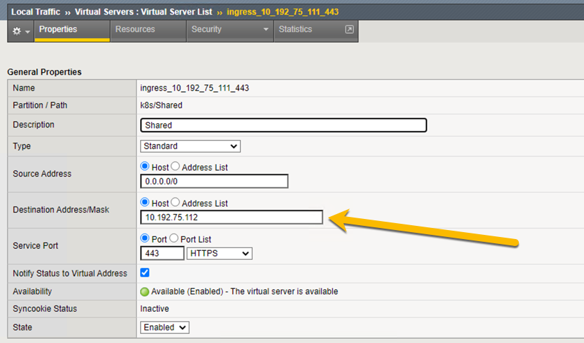

# AS3 Override with Ingress only

- Contact: Mark Dittmer - M.Dittmer@f5.com

## Notes

Recreating you K8S Ingress. I noticed a few issues

1. OLD K8S API – please change to the new API `networking.k8s.io/v1beta1` if you using K8S 1.17 and above
2. Remove `virtual-server.f5.com/partition`: "**kubernetes_AS3**" – This not needed and most likely causing an issue
3. Your ingress statement is completely invalid. Missing edge termination. Please add tls spec
4. AS3 override is missing label. I have correct the yaml

Created AS3 override, created Ingress

```
2020/10/02 17:43:10 [WARNING] [AS3] Saving AS3 override, no active configuration available in CIS
2020/10/02 17:43:39 [DEBUG] [AS3] Posting AS3 Declaration
2020/10/02 17:43:39 [DEBUG] [AS3] posting request to https://192.168.200.92/mgmt/shared/appsvcs/declare/
2020/10/02 17:43:41 [DEBUG] [AS3] Response from BIG-IP: code: 200 --- tenant:k8s --- message: success
2020/10/02 17:43:41 [DEBUG] [AS3] Preparing response message to response handler
2020/10/02 17:43:41 [DEBUG] [AS3] AppManager wrote endpoints to VxlanMgr
2020/10/02 17:43:41 [DEBUG] [AS3] Sent response message to response handler
```

Update the IP as per your request



Repository - [Serebryakov](https://github.com/mdditt2000/kubernetes-1-18/tree/master/cis%202.1/github/Serebryakov)

